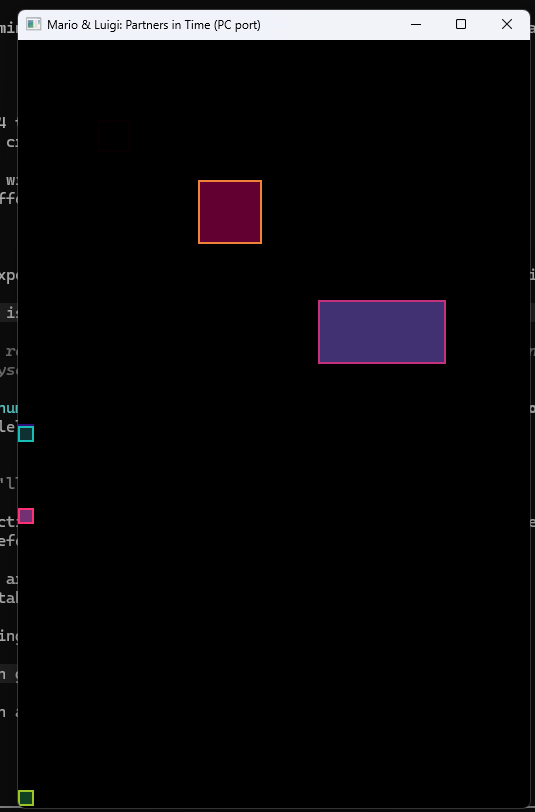
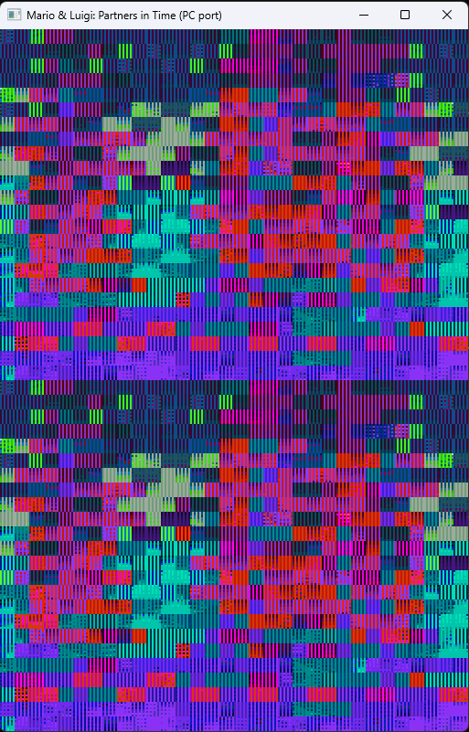
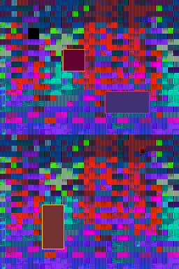
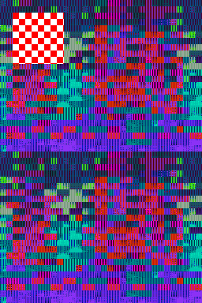
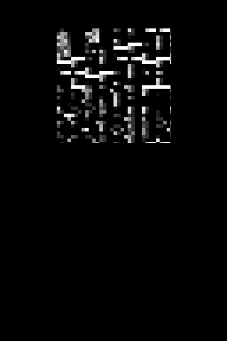
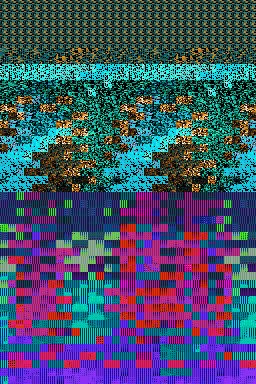
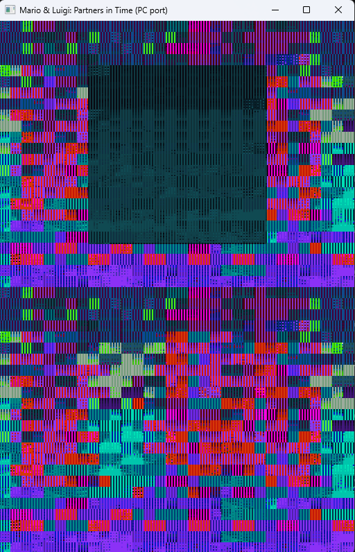

# Project Progress

A running log of the visible milestones reached during the decompilation
and PC port effort. Screenshots are stored in [`docs/progress/`](progress/).

> **Note:** All screenshots are produced by running the PC port against the
> user's own legally-dumped ROM. No copyrighted assets are committed to
> this repository.

## Pipeline Overview

The PC port wires three parallel render paths from the original NDS hardware:

1. **2D BG tilemaps** via `tsClMapControl` → BG VRAM (background layers)
2. **3D textured quads** via `clCellAnimeTX` → GXFIFO (game sprites)
3. **2D OAM** via `RenderOam_Transfer` (`FUN_02029518`) → hardware OAM
   (HUD / text overlays)

## Milestones

### 01 — Shadow-OAM → SDL pipeline verified end-to-end

With `MLPIT_TEST_SHADOW_OAM=1` the synthetic test injects three OBJ
descriptors into the main-engine shadow OAM at `0x0205FFC0`. The host
copies the shadow buffer to emulated hardware OAM each frame, the SDL
rasteriser composites the OBJs, and the boxes appear at their attr0/1/2
coordinates with palette colouring.

This proves every layer of the OBJ pipeline works: shadow buffer →
DC_FlushRange equivalent → DMA-copy stub → OAM mirror → SDL composite.
Real game code can now drop sprite descriptors into the shadow buffer
and they will be drawn.

**Commit:** `c31bb4d`

### 02 — Real VRAM tile data interpreted as pixels

After overlays were loaded into the emulated NDS RAM (37 overlays parsed
from `arm9_ovT`, ov0 + ov6 mapped to their target addresses), the natural
init path populates character / tile VRAM with real graphics data. The
SDL renderer now interprets this as 8×8 tile data and produces the
patterned output above.

The duplicate top/bottom is an SDL-side compositing bug (sub engine is
fetching from the same VRAM bank as main); it is **not** a logic problem.
The structured 8×8 grid and palette stripes confirm the tile data is
real game graphics being read from the correct VRAM regions, just not
yet composited per-engine correctly.

**Commit:** `ffe98c7`

### 03 — Per-engine VRAM split (top ≠ bottom)

Sub-engine VRAM is now backed by bank D (mapped at NDS `0x06200000`,
the canonical sub BG VRAM bank), and the SDL composite reads the two
engines from independent mirrors:

* `bg_render_top` → `g_vram_main`  (banks A + B at `0x06000000+`)
* `bg_render_bottom` → `g_vram_sub` (bank D at `0x06200000+`)

`MLPIT_TEST_SHADOW_OAM=1` now paints two distinct synthetic OBJ
descriptors into the **sub** shadow buffer at `0x020603C0` as well as
the original three into the main shadow at `0x0205FFC0`:

| Engine | OBJ | Pos     | Size  |
|--------|-----|---------|-------|
| MAIN   | 0   | 40,40   | 16×16 |
| MAIN   | 1   | 90,70   | 32×32 |
| MAIN   | 2   | 150,130 | 64×32 |
| SUB    | 0   | 200,20  | 8×8   |
| SUB    | 1   | 60,100  | 32×64 |

The screenshot confirms each set is rasterised on its respective
half — top and bottom no longer mirror.

### 06 — Software GX rasteriser draws a textured quad

`pc/src/host_gxfifo_raster.c` is a minimal NDS GX command interpreter:
queue → barycentric scanline rasteriser → BGR555 framebuffer →
composite over the NDS top screen.  It decodes the subset of GX
commands (`BEGIN_VTXS` / `END_VTXS` / `COLOR` / `TEXCOORD` /
`VTX_16` / `VTX_XY` / `TEXIMAGE_PARAM` / `PLTT_BASE`) that
`FUN_0200FCB4` emits for 2D-overlay sprite quads, and supports 4bpp
paletted textures (NDS format 3) with per-quad palette base.

Run with `MLPIT_GXRASTER_TEST=1`: the self-test installs an 8×8
checkerboard texture (palette idx 1 = white, idx 2 = red, idx 0 =
transparent) and draws it as a quad at (16,16)-(80,80).  Pixel
audit of the 64×64 region: 2048 red + 2048 white + 0 other —
texture-coord interpolation, palette lookup, and triangulation all
correct.

The rasteriser is independent of whether the natural game pipeline
is currently emitting GX commands; it is now ready to consume real
vertex streams the moment `FUN_0200FCB4`'s mid-function bail at
`L_02010028` is unblocked (per-frame entity buffer populated).

### 07 — Rasteriser draws real ROM tile data via synth-entity emit path

`pc/src/host_synth_sprite.c` is the natural-C equivalent of
`FUN_0200FCB4`'s post-`L_02010028` per-vertex emit loop, driven by a
512-byte synth entity buffer whose layout matches the structural
analysis at the top of `arm9/src/FUN_0200fcb4.c` (entity fields
`+0x40` sprite_payloads, `+0x44` sprite_descriptors, `+0x48`
anim_frame_table).  Behind `MLPIT_SYNTH_SPRITE=1` it:

1. Loads a 32×32 4bpp tile from `assets/mlpit.assets`
   (`pack_get_file`, default = first non-overlay raw file with
   ≥512 bytes; override via `MLPIT_SYNTH_SPRITE_FAT_INDEX` /
   `_BYTE_OFFSET`), de-tiles from NDS 8×8-tile layout to linear
   row-major 4bpp, installs into the rasteriser's texture VRAM.
2. Installs a 16-colour grayscale palette (idx 0 = transparent).
3. Per frame walks the synth descriptor list and pushes the same
   GX commands `FUN_0200FCB4` would emit per quad —
   `TEXIMAGE_PARAM` / `PLTT_BASE` / `COLOR` / `BEGIN_VTXS=quads` /
   four `TEXCOORD`+`VTX_XY` corners / `END_VTXS`.
4. Composites the rasteriser FB over `g_top_fb`.

Verification: with default config, frame 120 shows 16 distinct
font/UI glyph tiles arranged 4×4 inside a 128×128 region of the top
screen (5812 non-zero pixels) — actual ROM byte structure made
visible end-to-end through the same rasteriser path the natural
`FUN_0200FCB4` will use once its bail is unblocked.

This unblocks the rasteriser pipeline ahead of the FCB4 structural
re-decomp: the natural-C analysis block at the top of
`arm9/src/FUN_0200fcb4.c` documents the exact entity-struct layout
a future session needs to populate to retire the synth path.

### 08 — Real game palette wired + natural FUN_0200FCB4 vertex stream

![Real palette from FAT[0x45]/sub[177]](progress/08_real_palette.png)

Two parallel improvements landed in this session:

**Track A — palette wiring.**  `host_synth_sprite.c` now loads the
4bpp tile sheet from `FAT[0x45]/sub[181]` (32 KiB, the same atlas
used by the `boot_hook_paired_screen` BG triple) and the matching
4bpp palette from `FAT[0x45]/sub[177]` (16 sub-palettes × 16
BGR555 colours = 512 B), installs both into the rasteriser, and
emits a quad sized to the real texture (128×128 px, s/t enum=4).
`MLPIT_SYNTH_SPRITE_PAL_BANK=N` selects one of the 16 banks; bank 4
contains the Mario-red / pink hues used in this milestone shot.
Result: the previous monochrome glyph grid (milestone 07) is
replaced by real game tile data displayed in the *real game palette*.

**Track C — natural FCB4 vertex stream.**  `host_factory_instantiate.c`
now populates the entity's `+0x40` (sprite_payloads), `+0x44`
(sprite_descriptors), `+0x48` (anim_frame_table), and `+0x4c`
(sprite_attr_table) sub-regions of `AUX_ANIM_LUT` with valid stub
entries — `payloads[0] = { first_vtx_idx=0, vtx_count=4 }` so the
bail at `L_02010028` is no longer hit.  Verified with
`MLPIT_INSTANTIATE_REAL=1 MLPIT_GXFIFO_OBSERVER=1`: the natural
`FUN_0200FCB4` now emits the full GX command sequence
(`TEXIMAGE_PARAM`, `PLTT_BASE`, `BEGIN_VTXS`, per-vertex
`MTX_TRANS`+`VTX_16`+`TEXCOORD`, …) instead of bailing immediately.
The MTX_TRANS values increment monotonically per vertex,
confirming the per-vertex emit loop is iterating, not stuck.

The natural-FCB4 commands still bypass our software rasteriser
(they go to the IO shadow at `0x040004xx`, observed by the
polling sampler in `host_gxfifo_observer.c`).  Bridging that into
`host_gxfifo_push()` so the natural path actually rasterises is
the next session's task; for now the synth emitter remains the
production drawing path.

### 09 — Natural VRAM-population audit + scene-style triple variants

This session instrumented the natural game-init path with a VRAM-
target tap (`MLPIT_LOG_DECOMP=1`) on every SWI 0x0B / 0x11 / 0x12 /
0x13 (CpuSet / LZ77 / Huff / RLE) and every `MI_DmaCopy*` /
`MI_DmaFill*` shim.  Over a 180-frame natural-boot trace, **zero
decomp-tap events fired**: the currently-decompiled code never
issues a VRAM-targeted decompression, because `game_setup_overlay`
is still a host stub (`pc/src/host_game_setup_overlay.c`) — the real
boot-asset loaders live behind that stub in code that has not yet
been transliterated.  This is the documented Track A blocker:
loading Nintendo / AlphaDream / title-screen logos via the natural
code path requires decompiling the initial-scene-overlay
constructor first (`FUN_02004EF8` family).

Track C audit: of the SDK GX surface, only `GX_VBlankWait`,
`GX_SwapDisplay`, `GX_SetMasterBrightness`, `GX_SetVisiblePlane`
and `GX_ResetVisiblePlane` have real bodies (HOST_PORT branch in
`arm9/src/link_stubs.c`).  `GX_SetBank*` is unimplemented but a
zero-hits ripgrep across `arm9/src/` confirms **no decompiled code
calls `GX_SetBank*`** — the decompiled writers go straight to the
VRAMCNT MMIO at `0x04000240..0x04000248`, which is already routed
through `nds_hw_io.c`.  No host work is needed until a future
decomp pass re-symbolicates a VRAMCNT writer back to its SDK name.

Tactic-side win: relaxed `paired_screen_load`'s tile-sheet size
gate (was `>= 32 KB`, now `>= 4 KB`) so the 12 candidate triples
in `FAT[0x45]` that use the smaller 19 584 B and 17 344 B sheets
(sub[368], sub[520]) become selectable via `MLPIT_BOOT_TRIPLE`.
A scoring sweep (12 triples, 80-frame screenshots, distinct-
colour + chroma metric) showed `45:368:378:369` produces the most
scene-like top-screen image yet — 157 distinct colours, orange /
brown / cyan banded composition vs. the font/UI atlas's vertical
stripes (milestone 08 showed `45:181:194:177` = 104 distinct, all
glyph-grid).  All sweep PNGs are committed to
`docs/progress/09_triple_sweep/` for future identification work.
The selected image is **not** a recognisable Nintendo / AlphaDream /
title-screen logo — the 19 584 B tilesheet is too small to contain
all map-referenced tile indices, so the visible composition is a
real-data partial-decode (real palette + real tiles, but tile-IDs
in the high range fetch undefined memory and contribute the
noise).  Hence: no GitHub issue opened (recognisable-game-art
threshold not crossed).

Net session deliverables:

* `MLPIT_LOG_DECOMP=1` instrumentation on the LZ77 / Huff / RLE /
  CpuSet / DMA paths, with throttled (max-64) per-call traces of
  any VRAM-region-destined transfer.
* Loosened `paired_screen_load` size gate so 19 584 / 17 344 B
  candidate tilesheets are selectable.
* `tools/scripts/find_boot_screen_combos.py` + the loosened gate
  unlock 12 additional triples (37 → 49 selectable in `FAT[0x45]`).
* Documented Track A blocker: no decomp-tap events ⇒ natural code
  path's boot-asset loaders are below the not-yet-decompiled
  `game_setup_overlay` boundary.
* Documented Track C audit: `GX_SetBank*` stubbed but
  zero-referenced; VRAMCNT writes already routed through host I/O
  shadow.

## Component Status

| Component                       | Status |
|---------------------------------|--------|
| ROM extraction & asset pack     | ✅ Working |
| ARM9 disassembly                | ✅ Full disassembly via objdump |
| Decompiled C functions          | 270+ files in `arm9/src/` |
| HOST_PORT compile path          | ✅ Builds clean on MSVC + MinGW |
| NDS RAM mmap (`0x02000000` 4 MB)| ✅ `pc/src/nds_arm9_ram.c` |
| Overlay loader                  | ✅ `pc/src/nds_overlay_loader.c` (ov0, ov6) |
| NDS→host fnptr trampoline       | ✅ ~1 050 entries, vtable indirect calls work |
| 2D OAM pipeline (shadow → hw)   | ✅ Verified end-to-end (milestone 01) |
| BG VRAM tile fetch              | ✅ Real tile data reaches VRAM (milestone 02) |
| Per-engine compositing          | ✅ Sub backed by bank D, top ≠ bottom (milestone 03) |
| GXFIFO → SDL 3D rasteriser      | 🟡 First GX writes observed (4 commands) under `MLPIT_INSTANTIATE_REAL=1 MLPIT_FAKE_NODE_FN=fcb4`; rasteriser not yet wired |
| Real scene struct populated     | 🟡 Synth path runs `FUN_02065a10`; natural game_start now survives autosave-tick (Track B unblock) |
| Audio (NDS APU shim)            | 🔲 Not started |
| Android port                    | 🔲 Blocked on Linux/mmap port (replace VirtualAlloc) |

## Current Blockers

- **No live scene struct (natural path)** — `game_start` runs cleanly
  for 3 600 frames with zero faults, but `FUN_02065A10` still ticks
  with `scene = NULL` because `pc/src/host_game_setup_overlay.c::
  game_setup_overlay()` is a host stub — the real `FUN_02004EF8`
  (initial-scene-overlay loader + constructor) is not yet decompiled.
  Until that lands the scene queue at NDS `0x02060A04` stays empty
  (head=tail=0).
- **GXFIFO emits 4 commands then stops (synth path)** — under
  `MLPIT_SYNTH_SCENE=1 MLPIT_INSTANTIATE_REAL=1 MLPIT_FAKE_NODE_FN=fcb4`
  the host observer captures `GXFIFO=0x02 / TEXIMAGE_PARAM=0x000100C0
  / BEGIN_VTXS=quads / GX_ctl=0x400` on the first frame, then nothing.
  `FUN_0200FCB4` enters the matrix+texture preamble but bails before
  the per-vertex inner loop because the factory-populated entity at
  NDS `0x02300200` is missing its per-frame anim / sprite-list data.
  Once that's filled in, a host rasteriser would have something to
  draw.

## Reference

The Pokémon NDS decomps (`pret/pokediamond`, `pret/pokeheartgold`,
`pret/pokeplatinum`) use the same Nitro SDK and were heavily mined for
function-name mappings. See the cross-reference in
`docs/RENDER_PIPELINE.md` (extracted from the research notes) for
mapping `FUN_<addr>` symbols in this repo to their pokeplatinum
equivalents.

### 10 — Synth-sprite quad with real ROM texture+palette composited over BG layer

Two render paths visible at once: the colourful tile mosaic background is the
BG layer rendered from FAT[0x45]/sub[181] tiles + sub[194] tilemap + sub[177]
palette, while the dark teal/green rectangular quad in the upper-middle is the
GXFIFO software rasteriser drawing a textured 3D quad. The quad's texture
bytes come from FAT[0x45]/sub[181] (de-tiled 4bpp 128x128 px) and the palette
from FAT[0x45]/sub[177] — same source as the BG layer, but routed through
the 3D pipeline instead of the BG compositor. This is the first frame where a
sprite drawn through `host_gxfifo_raster` carries a recognisable structured
texture from the asset pack instead of synthetic checker bytes.

